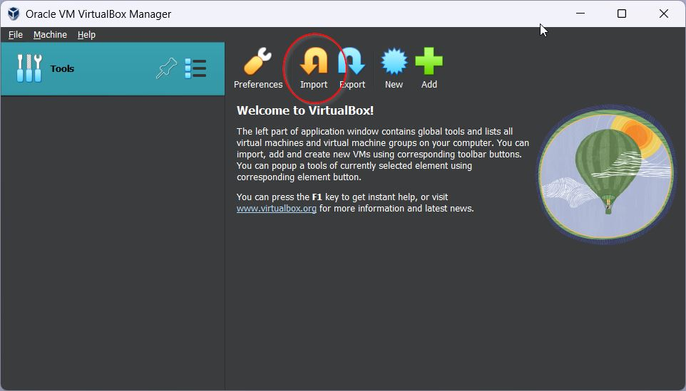
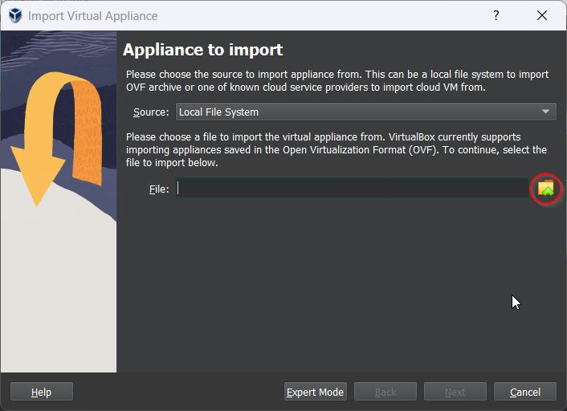
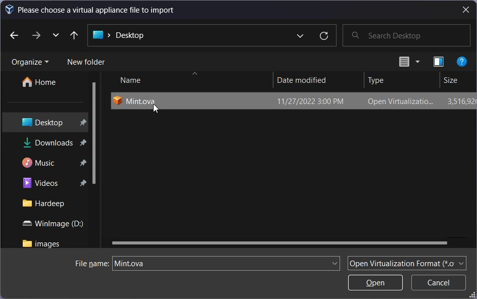
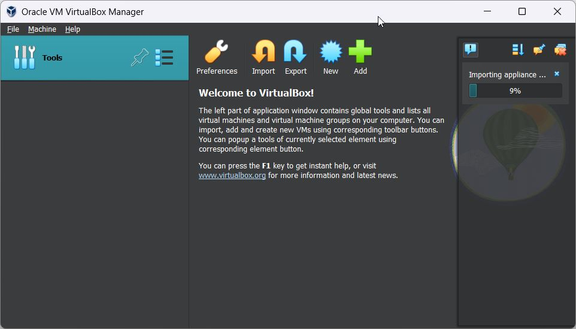
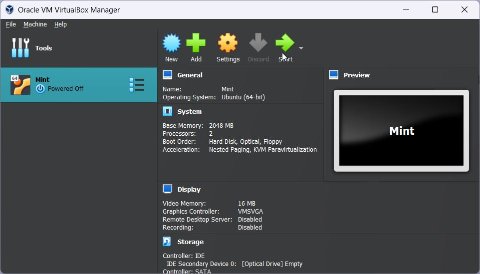

# Run Linux inside windows with Virtual Box

### Minimum Requirements

Intel Core I3 or greater

RAM - 8 GB

Free Hard Disk Space - 15 GB

## Procedure

1. Download virtual box from [here](https://download.virtualbox.org/virtualbox/7.0.4/VirtualBox-7.0.4-154605-Win.exe) and Linux mint OVA file from [here](https://drive.google.com/file/d/1LcQ8job3K_qLCPilpUZT1k4KFraVYqLB/view?usp=sharing).

2. Install Virtual Box with default settings and open it from start menu.

3. Select **import** option

   

4. Click folder option and select OVA file downloaded in first step.

   	

5. Click on **next** and **finish** the wizard with default settings. Wait for import process to complete.

   

6. Finally **start** imported Linux Machine

   