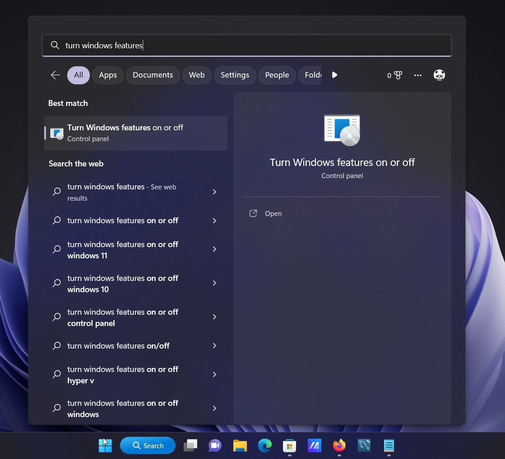
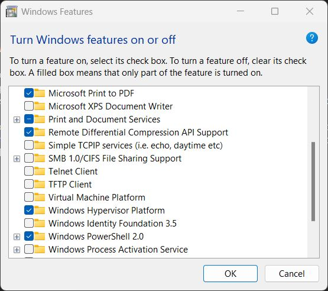
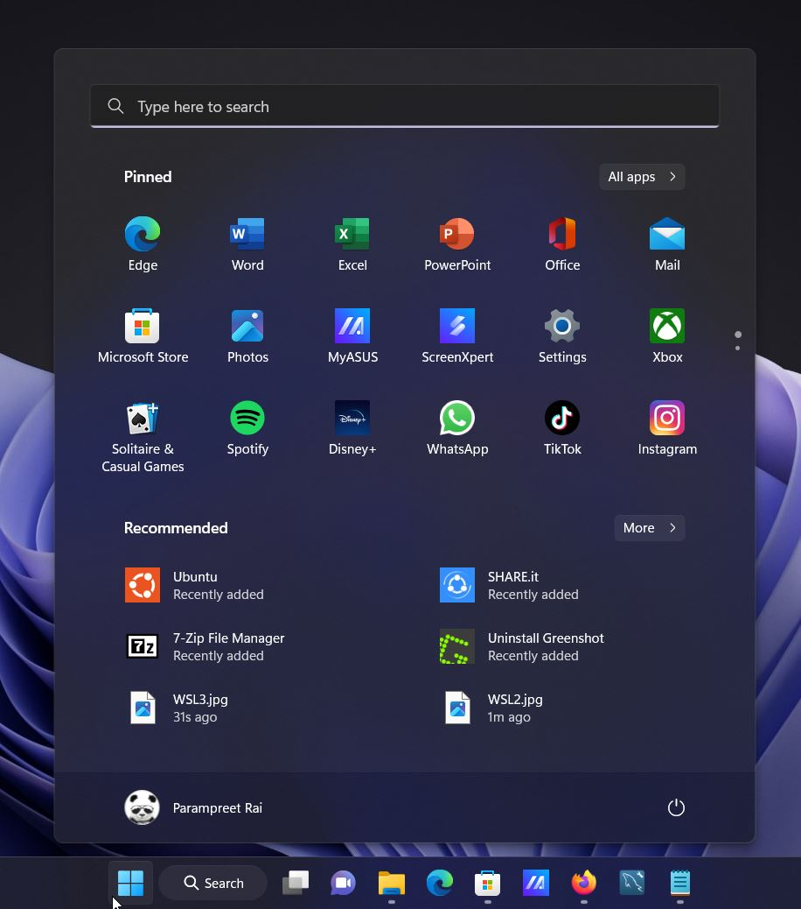
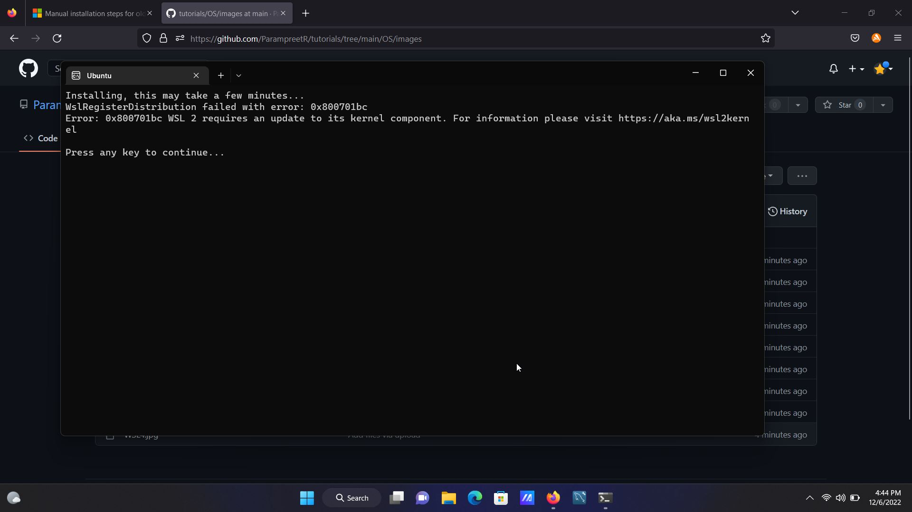

# Run Linux inside windows using WSL

1. Open the Start menu and type "Windows features" into the search bar and click on "Turn Windows Features On or Off".

2. Tick the "Windows Subsystem for Linux" checkbox and press the “OK” button.
   

3. When the operation is complete, you will be asked to restart your computer.

4. Use the Microsoft Store app and look for the Linux distribution you want to use for example Ubuntu.
   

5. The Linux distribution can be launched from the Start menu.
   

## Note
If you faced following error

Then download and install [this](https://wslstorestorage.blob.core.windows.net/wslblob/wsl_update_x64.msi) package
